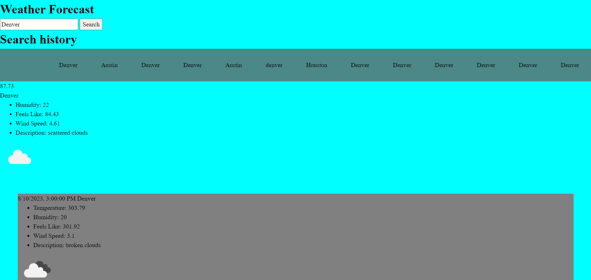

# weatherforecast

## Description

This web application is designed to figure out what weather will look like in your selected area, including current weather information and a 5 day forecast.
This will store your searches into a search bar on the top of the screen as well as save to local storage so the previous search persists. I will return to this project for some final cosmetic changes, however functianlity wise it should be all but final polished
## User information
The user of this application is looking to get current weather information or forecast location of a selected city

## Links

Link to Repository
https://github.com/ccoff1798/weatherforecast

Deployed Site
https://ccoff1798.github.io/weatherforecast/

## Screenshot

## Credits

This project is a solo project